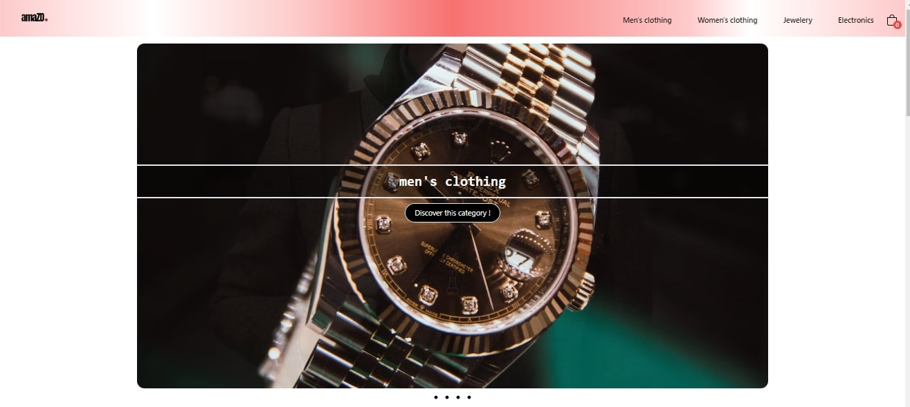

# AmaZD: E-commerce website

 ## Overview

## 

## Introduction

[AmaZD](https://e-commerce-project-amazon.vercel.app/) is an e-commerce website that's crafted to deliver an effortless shopping journey. It aims to offer a convenient and visually pleasing shopping experience, making it effortless for users to explore and purchase products in various categories."

## Tools Used
- **NEXT.js**: A framework for building server-rendered React applications.
- **Tailwind CSS**: A utility-first CSS framework for fast and responsive web development.
- **React icons**: for a uniform and appealing icons throughout the project.
- **Prettier**: Enforces code format.
- **Eslint**: Enforces code quality.
- **Husky**: Used to run prettier + eslint before commiting the code. Saves time and ensures the code is formatted correctly and follows the correct coding standards.
- **Commitizen + Commitlint**: Used to follow the correct method of commiting your code.
- **Lintstaged**: Gives us the ability to run commands on staged files (ie: files that have not been commited yet).

## Team Members

- Hachem Bouhadede:
[linkedin](https://linkedin.com/in/hachem-bouhadede/) ||
[github](https://github.com/HachemBouhadede)
- Ismail Benlaredj:
[linkedin](https://linkedin.com/in/ismailbenlaredj/) ||
[github](https://github.com/ismail-benlaredj)
- Hadia Djadallah:
[linkedin](https://linkedin.com/in/hadia-djadallah/) ||
[github](https://github.com/liliumorion)
- Hakim Tiabi:
[linkedin](https://linkedin.com/in/abdelhakimtiabi/) ||
[github](https://github.com/Hxkim10)
- Meriem Mansouri:
[linkedin](https://linkedin.com/in/meryem08/) ||
[github](https://github.com/meryem08)
- Dalila Meguenni:
[linkedin](https://linkedin.com/in/dalilia/) ||
[github](https://github.com/dalilia)

